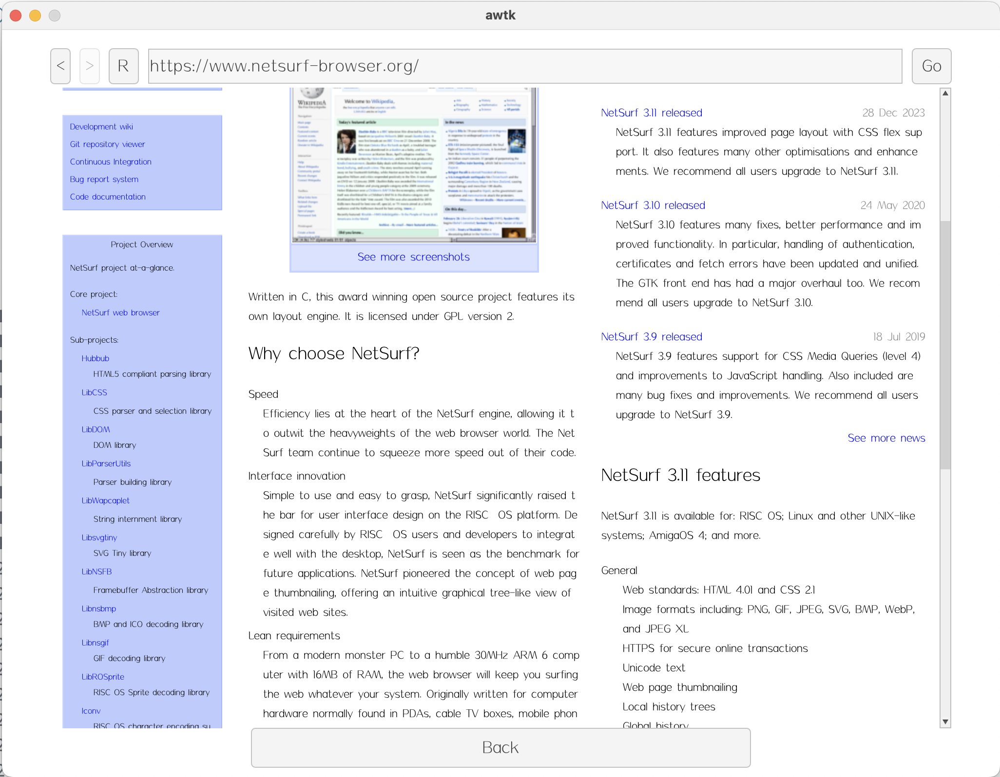

# awtk-widget-netsurf

AWTK Web View 控件。

> AWTK Web View 控件是基于 [netsurf](https://www.netsurf-browser.org/) 实现的，在此感谢 [netsurf](https://www.netsurf-browser.org/)的开发者。

> 本项目目前还处于实验阶段，只在 MacOS 测试。请勿使用。 

界面效果



## 准备

1. 获取 awtk 并编译

```
git clone https://github.com/zlgopen/awtk.git
cd awtk; scons; cd -
```

1. 获取 netsurf 并编译

```
cd 3rd/netsurf
```

> 获取代码

```
./git-all.sh
```

> 打补丁

```
./patch.sh
```

> 编译

```
./build.sh 
```

> 安装数据文件

```bash
sudo mkdir -p /opt/netsurf
cp -rf netsurf/frontends/framebuffer/res/* /opt/netsurf
```

## 运行

1. 生成示例代码的资源

```
python scripts/update_res.py all
```

2. 编译

* 编译PC版本

```
scons
```

3. 运行

```
export DYLD_LIBRARY_PATH=bin
./bin/demo
```

## 使用方法

* 不需要滚动，直接嵌入HTML代码：

```xml
<html x="50%" w="40%" h="80%" yslidable="false">
<property name="text">
  <![CDATA[
    <!DOCTYPE html>
    <html>
    <body>

    <p>I am normal</p>
    <p style="color:red;">I am red</p>
    <p style="color:blue;">I am blue</p>
    <p style="font-size:50px;">I am big</p>
    <image src="logo" />

    </body>
    </html>
  ]]>
</property>
</html>
```

* 滚动视图，从文件加载：

```xml
  <html_view x="50" y="50" w="-100" h="-120" >
    <html w="-12" h="100%" url="file://./data/index.html" />
    <scroll_bar_d name="bar" x="right" y="0" w="12" h="100%" value="0" row="30"/>
  </html_view>
```


